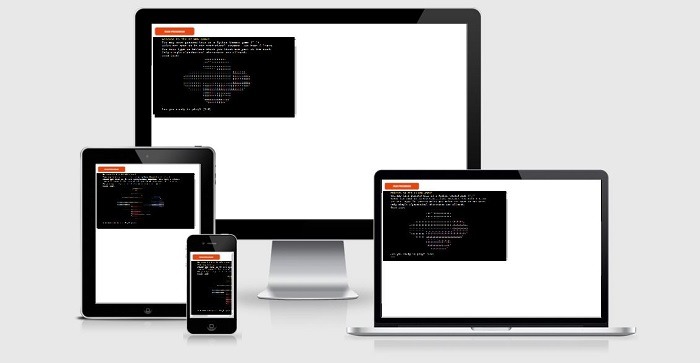
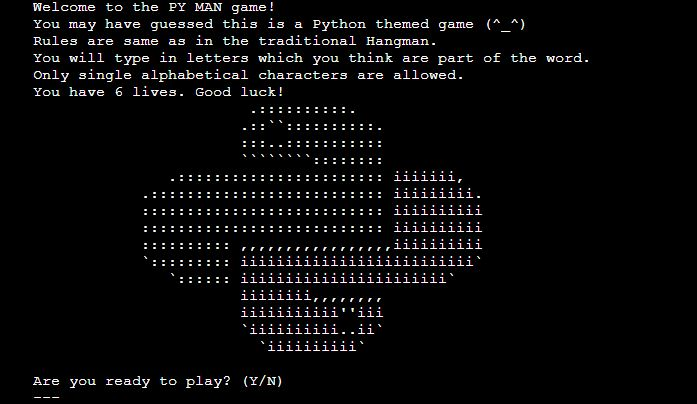
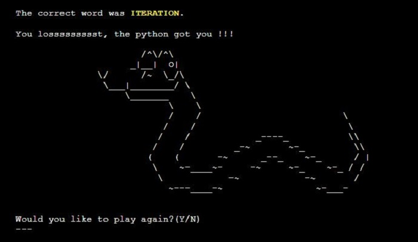

# **PY MAN GAME**

You can see the live site [here](https://py-man.herokuapp.com/).

The PY MAN application is a hangman style game with Python programming language as its theme. 

It is a simple terminal game, which runs on a mock terminal on Heroku.

*Please press **Ctrl** in Windows or **Command** on Mac button and click for any links which you would like to open in a new tab when in the README.md file*

## **FEATURES**
###  **Initial screen**
    - Welcome text with rules of the game and how to play
    - Command line asking user for input if they want to play

###  **Random word & number of lives**
    - If user continues in the game, the next screen will show title PY word and the same number of underscores as letters in the guessed word.
    - Users are reminded here that have 6 lives.
    - Command line prompting users to guess a letter

### **Correct and incorrect guess**
    - If letter is guessed correctly, text is printed in green telling the user that letter is correct and the PY word will update
    - If guessed is incorect, the message announcing this is printed in red color

### **Winning screen**
    - If user wins, the correct guessed word is announced and highlighted in yellow color
    - Message announcing user lost the game is printed on the screen together with python graphic
    - Command line asking users if they would like to play again

### **Losing screen**
    - If user loses, the correct guessed word is announced and highlighted in yellow color
    - Message announcing user lost the game is printed on the screen together with python graphic
    - Command line asking users if they would like to play again

## **FUTURE DEVELOPMENT**
    - Take players names down and create score counter with high scores table

## **TESTING**

[wireframes](assets/images/Python-Man.png)

### **VALIDATOR TESTING**

## **BUGS**

-   I had an issue with the game when word was guessed successfully, the game wouldn't finish until user used all lives available. The issue got resolved upon changing the code which checked the lenght of the guessed letters and the play_word(masked word). However this worked only on words with non-repeating characters. If word, e.g mixin, had two or more repeating character inside, the game wouldn't count it in. The count method and counter need to be implemented. 

- I originally used [Pypi](https://pypi.org/project/colorama/) to implement red and green colors to differentiate between correct and incorrect input. However it didn't work when deployed to Heroku and I reverted to using a class. 

## **UNFIXED BUGS**
-   

## **DEPLOYMENT**

The project was deployed using Code Institutes mock terminal for Heroku.

The steps to deploy are as follows:
1. Fork or clone this repository
2. Save all your work and push all changes. Make sure you added \n to all your input code.
3. This project doesn't have any external libraries therefore my requirements.txt file is empty. Otherwise I'd have to follow this step: 
    *type in terminal pip3 freeze > requirements.txt, then save and push the changes into GitHub*
4. Create a new app in Heroku.
5. Select **'New'** and **'Create new app'**.
6. Name the new app and click **'Create new app'**. Name should be something unique, otherwise it won't allow us to continue
7. Go to the settings tab and find the Config Vars section. Click **'Reveal Config Vars'**. Here you should upload content from creds.json file. I don't use it in my project, there are no sensitive data to be protected, therefore I skipped this step.
8. While still in Config Vars, add into KEY: **PORT** and VALUE: **8000**. 
9. After select **'BuildPack'** which is below Config Vars. Select **Python** and save, then select **Nodejs** and save again. It has to be in this specific order. If you have made a mistake, you can drag the Python buildpack and move to the first place. 
10. Click on **'Deploy'** and select your deploy method and repository. You do this by entering the repository name as it is in GitHub then click *'search'*.
11. Click on **'Connect'** button on selected repository.
12. I chose **'Enable Automatic Deploys'** to rebuild my app automatically every time I push any changes in Gitpod.
13. Now deploy by scrolling down and click the **'Deploy Branch'** button. Heroku will notify you that the app was successfully deployed with a button to view the app.
14. The live app address is **https://py-man.herokuapp.com/**.

## **CREDITS**
- Thanks to tutors from Tutor Support - namely Sean Murphy and John Traas.

- I used **w3schools** and **docs.python** which helped me understand Python functions and method better. 

- I used colors from [GeeksforGeeks](https://www.geeksforgeeks.org/print-colors-python-terminal/) to implement red, green and yellow colors to differentiate between correct and incorrect input. 

- **CONTENT**

- **CODE**

- Code from function delete_last_line() was specifically written for my need by a felow coder on stackoverflow.com as I have tried various solutions to what I wanted to achieve and nothing has worked. 

- 
 