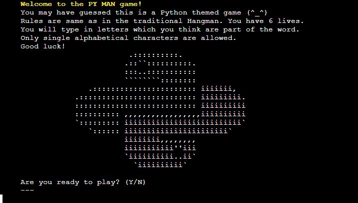

# **PY MAN GAME**

You can see the live site [here](https://py-man.herokuapp.com/).

The PY MAN application is a hangman style game with Python programming language as its theme. 

It is a simple terminal game, which runs on a mock terminal on Heroku. I wanted to maintain an eye pleasing features throughout the game for a good user experience. I created a five character indent space from the left and maintained it throughout the game to enable easier readability. All input is being printed out with the indent as well. 

Users start with having 5 lives to guess a word and is shown the rules of the game when the terminal starts up. 

*Please press **Ctrl** in Windows or **Command** on Mac button and click for any links which you would like to open in a new tab when in the README.md file*

## **FEATURES**
###  **Initial screen**
- Welcome text with rules of the game and how to play
- Command line asking user for input if they want to play

- If user chooses to not play the game, a message will be printed and game will end

###  **Random word & number of lives**
- If user continues in the game, the next screen will show title PY word and the same number of underscores as letters in the guessed word.
- Users are reminded here that have 5 lives.
- Command line prompting users to guess a letter

### **Correct and incorrect guess**
- If letter is guessed correctly, text is printed in green telling the user that letter is correct and the PY word will update
- If guessed is incorect, the message announcing this is printed in red color

### **Winning screen**
- If user wins, the correct guessed word is announced and highlighted in yellow color
- Message announcing user lost the game is printed on the screen together with python graphic
- Command line asking users if they would like to play again

### **Losing screen**
- If user loses, the correct guessed word is announced and highlighted in yellow color
- Message announcing user lost the game is printed on the screen together with python graphic
- Command line asking users if they would like to play again

### **Playing again**
- When users finish the game, they will be asked if they would like to play again
- ***Yes*** answer will restart the game and new word will be randomly selected
- ***No*** will end the game and message will be printed into the terminal

## **FUTURE DEVELOPMENT**
- Take users' names down
- Create a score counter with high scores table
- More refactoring of the code. I have refactored some of the repetitive code and put it into a smaller function to keep the main function tidy.

## **DATA MODEL**
- The main object of the game is a list of words in a separate file called *py_words.py* to get necessary data for the game. The function get_random_word() together with *random* module with *choice* method chooses a word for each time the game is started. 

- The letters are not shown at the beginning. Underscores work as their replacements and as the game progresses and user makes correct guesses, the letters are being saved and are replacing the underscores. All guessed letters are saved so they can be checked against user's input and call out any errors like duplicate input and non-alphbetical input. 

## **TESTING**

### I have manually tested the project by doing the following:

- I created a flow chart before I started coding for this project to help me with the logic and steps throughout the game and the overall thought process. I used [Diagrams](https://app.diagrams.net/?src=about) for my flow chart.

- Game was tested in local terminal on Gitpod and in the Code Institute Heroku terminal once deployed
- I tested the game by using giving invalid inputs to confirm error messages work as intended
    - Users can only enter single alphabetical characters

    

    - Users will be warned if they enter a letter they already typed into terminal

    

### **VALIDATOR TESTING**
- No errors were returned from [PEP8](http://pep8online.com/)

### **BUGS**

-   There was a bug in the game when the masked word was guessed successfully, the game wouldn't finish until user used all lives available. The issue got resolved upon changing the code which checked the lenght of the guessed letters against the len(play_word_set). 

- I had an issue when testing the restart function. 

- I originally used [Pypi](https://pypi.org/project/colorama/) to implement red and green colors to differentiate between correct and incorrect input. However it didn't work when deployed to Heroku and I have therefore used class ColorText and print colors. 

### **UNFIXED BUGS**
-   No known bugs left.

## **DEPLOYMENT**

The project was deployed using Code Institutes mock terminal for Heroku.

The steps to deploy are as follows:
1. Fork or clone this repository
2. Save all your work and push all changes. Make sure you added \n to all your input code.
3. This project doesn't have any external libraries therefore my requirements.txt file is empty. Otherwise I'd have to follow this step: 
    *type in terminal pip3 freeze > requirements.txt, then save and push the changes into GitHub*
4. Create a new app in Heroku.
5. Select **'New'** and **'Create new app'**.
6. Name the new app and click **'Create new app'**. Name should be something unique, otherwise it won't allow us to continue
7. Go to the settings tab and find the Config Vars section. Click **'Reveal Config Vars'**. Here you should upload content from creds.json file. I don't use it in my project, there are no sensitive data to be protected, therefore I skipped this step.
8. While still in Config Vars, add into KEY: **PORT** and VALUE: **8000**. 
9. After select **'BuildPack'** which is below Config Vars. Select **Python** and save, then select **Nodejs** and save again. It has to be in this specific order. If you have made a mistake, you can drag the Python buildpack and move to the first place. 
10. Click on **'Deploy'** and select your deploy method and repository. You do this by entering the repository name as it is in GitHub then click *'search'*.
11. Click on **'Connect'** button on selected repository.
12. I chose **'Enable Automatic Deploys'** to rebuild my app automatically every time I push any changes in Gitpod.
13. Now deploy by scrolling down and click the **'Deploy Branch'** button. Heroku will notify you that the app was successfully deployed with a button to view the app.
14. The live app address is **https://py-man.herokuapp.com/**.

## **CREDITS**
- Thanks to Code Institute for the deployment terminal
- 
- Thanks to tutors from Tutor Support - namely Sean and John for guiding me through my issues with repetitive characters not being counted into the masked word and huge thanks to Igor who helped me find a bug in my while statement logic.

- I used **w3schools** and **docs.python** which helped me understand Python functions and method better. 

- I used colors from [GeeksforGeeks](https://www.geeksforgeeks.org/print-colors-python-terminal/) to implement red, green and yellow colors to differentiate between correct and incorrect input. 

- **CODE**

- Code from function delete_last_line() was specifically written for my need by a felow coder on stackoverflow.com as I have tried various solutions to what I wanted to achieve and nothing has worked. I commented the relevant code in my *run.py* file.
 