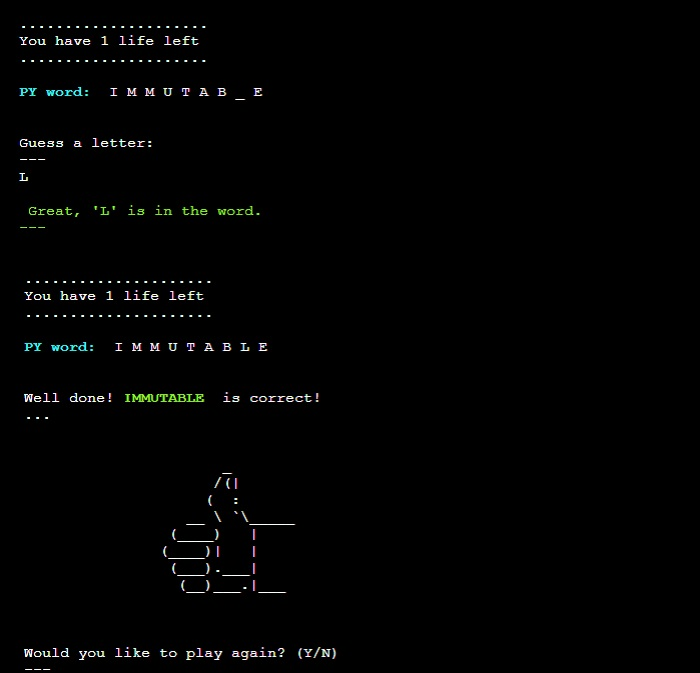

# **PY MAN GAME**

You can see the live site **[here](https://py-man.herokuapp.com/).**

The PY MAN application is a hangman-style game with Python programming language as its theme.
The target audience can be anyone with an interest in programming languages. This app could also work as just for fun activity for all ages which could attract an interest in coding

It is a simple terminal game, which runs on a mock terminal on Heroku. I wanted to maintain eye-pleasing features throughout the game for a good user experience. I created a five-character left indent and maintained it throughout the game to enable easier readability. All user input is also being printed out with the same indent. 

Rules of the game are shown when the terminal starts up. Users start the game with having 5 lives to guess the word.

*Please press **Ctrl** in Windows or **Command** on Mac button and click for any links which you would like to open in a new tab when in the README.md file*

## **FEATURES**
###  **Initial screen**
- Welcome text with rules of the game and how to play
- Command-line asking users for input if they want to play

    

- If the user chooses to not play the game, a message will be printed and the game will end

    

###  **Random word & number of lives**
- If the user continues in the game, the next screen will show the title PY word in cyan color, and the same number of underscores as letters in the guessed word.
- Users are reminded here that they have 5 lives.
- Command-line is printed, prompting users to guess a letter

    

### **Correct and incorrect guess**
- If a letter is guessed correctly, the text is printed in green telling the user that the letter is correct and the PY word will update
- If guessed letter is incorrect, the message announcing this is printed in red color and live will be deducted from the total

    

### **Winning screen**
- If the user wins, the correctly guessed word is announced and highlighted in green color
- Message announcing user won the game is printed on the screen together with a thumbs-up graphic
- Command-line is printed, asking users if they would like to play again

    

### **Losing screen**
- If the user loses, the correct word is printed on the screen and highlighted in yellow color, followed by a printed message, announcing the user lost the game, together with a python graphic
- Command-line is printed, asking users if they would like to play again

    

### **Playing again**
- When users finish the game, they will be asked if they would like to play again as mentioned in previous section
- ***Yes*** answer will restart the game and a new word will be randomly selected
- ***No*** will end the game and a message will be printed into the terminal

    

## **FUTURE DEVELOPMENT**
- Ask users to type their names into the terminal
- Create a score counter with high scores table
- I have refactored some of the repetitive code, but I would like to refactor more of my code and split it into smaller functions to keep the code tidier.

## **DATA MODEL**
- I created a flow chart before I started coding for this project to help me with the logic and steps throughout the game and the overall thought process. I used [Diagrams](https://app.diagrams.net/?src=about) for my flow chart.

    

- The main object of the game is a list of words in a separate file called *py_words.py* to get the necessary data for the game. The function get_random_word() together with *random* library with *choice* method chooses a word for each time the game is started.

- The letters are not shown at the beginning. Underscores work as their replacements and as the game progresses and the user makes correct guesses, the letters are being saved and are replacing the underscores. 

- All guessed letters are saved so they can be checked against the user's input and call out any errors like duplicate input and non-alphabetical input as shown in the **TESTING** section.

- I wanted the main user choices, such as **Y** and **N**, to print as **Yes** or **No** into the terminal which has been enabled with function delete_last_line() as it deletes the actual user input and prints over it with Yes or No statements, depending on their choice.

    

## **TESTING**

### I have manually tested the project by doing the following:
- Game was tested in the local terminal on Gitpod and in the Code Institute Heroku terminal once deployed
- I tested the game by using giving invalid inputs to confirm error messages work as intended
    - Users can only enter single alphabetical characters

    

    - Users will be warned if they enter a letter they already typed into the terminal

    

### **VALIDATOR TESTING**
- All python code was checked via [PEP8](http://pep8online.com/) with no errors reported.

    

### **BUGS**

- A bug occurred when I built the restart() function as when the user selected Yes, it would ask again, this time from the command line of the play() function. This issue got fixed by giving an argument of first_play and creating different conditions for when the game is played the first time and when the game is restarted. *(lines 70, 78-85)*

    

- There was a bug in the game when the masked word was guessed successfully, the game wouldn't finish until the user used all lives available. The issue got resolved upon changing the code which checked the length of the guessed letters against the len(play_word_set) *(lines 127-129 and 138)*

- I originally used [Pypi](https://pypi.org/project/colorama/) to implement red and green colors to differentiate between correct and incorrect input. However it didn't work when deployed to Heroku and I have therefore built a class ColorText and chose foreground colors of cyan, green, red, yellow, white, and bold style.

    

### **UNFIXED BUGS**
-   No known bugs left.

## **DEPLOYMENT**

The project was deployed using Code Institutes mock terminal for Heroku.

The steps to deploy are as follows:
1. Fork or clone this repository
2. Save all your work and push all changes. Make sure you added \n to all your input code.
3. This project doesn't have any external libraries therefore my *requirements.txt* file is empty. Otherwise, I'd have to follow this step: 
    *type in terminal pip3 freeze > requirements.txt, then save and push the changes into GitHub*
4. Create a new app in Heroku.
5. Select **'New'** and **'Create new app'**.
6. Name the new app and click **'Create new app'**. The name should be something unique, otherwise, it won't allow us to continue
7. Go to the settings tab and find the Config Vars section. Click **'Reveal Config Vars'**. Here you should upload content from creds.json file. I don't use it in my project, there are no sensitive data to be protected, therefore I skipped this step.
8. While still in Config Vars, add into KEY: **PORT** and VALUE: **8000**. 
9. After selecting **'BuildPack'** which is below Config Vars. Select **Python** and save, then select **Nodejs** and save again. It has to be in this specific order. If you have made a mistake, you can drag the Python buildpack and move to the first place. 
10. Click on **'Deploy'** and select your deploy method and repository. You do this by entering the repository name as it is in GitHub then clicking *'search'*.
11. Click on **'Connect'** button on the selected repository.
12. I chose **'Enable Automatic Deploys'** to rebuild my app automatically every time I push any changes in Gitpod.
13. Now deploy by scrolling down and clicking the **'Deploy Branch'** button. Heroku will notify you that the app was successfully deployed with a button to view the app.
14. The live app address is **https://py-man.herokuapp.com/**.

## **CREDITS**
- Thanks to Code Institute for the deployment terminal
- Huge thanks to my mentor Maria Hynes who has again supported support and encouraged me throughout the whole project
- Thanks to tutors from Tutor Support - namely Sean and John for guiding me through my issues with repetitive characters not being counted into the masked word and big thanks to Igor who helped me find a bug in my while statement logic in my play() function.

- I used **w3schools** and **docs.python** which helped me understand Python functions and methods better. 

- I used colors from [GeeksforGeeks](https://www.geeksforgeeks.org/print-colors-python-terminal/) to implement red, green, and yellow colors to differentiate between correct and incorrect input. 

### **CODE**
- Code from function delete_last_line() was specifically written for my need by a fellow coder on stackoverflow.com as I have tried various solutions to what I wanted to achieve and nothing has worked. I commented on the relevant code in my *run.py* file on lines 57 to 67.
 